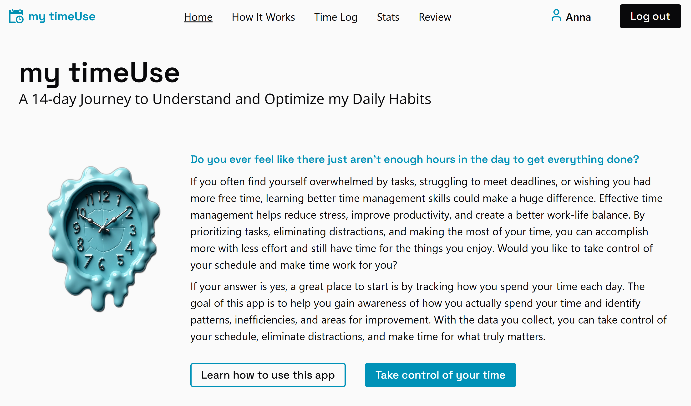
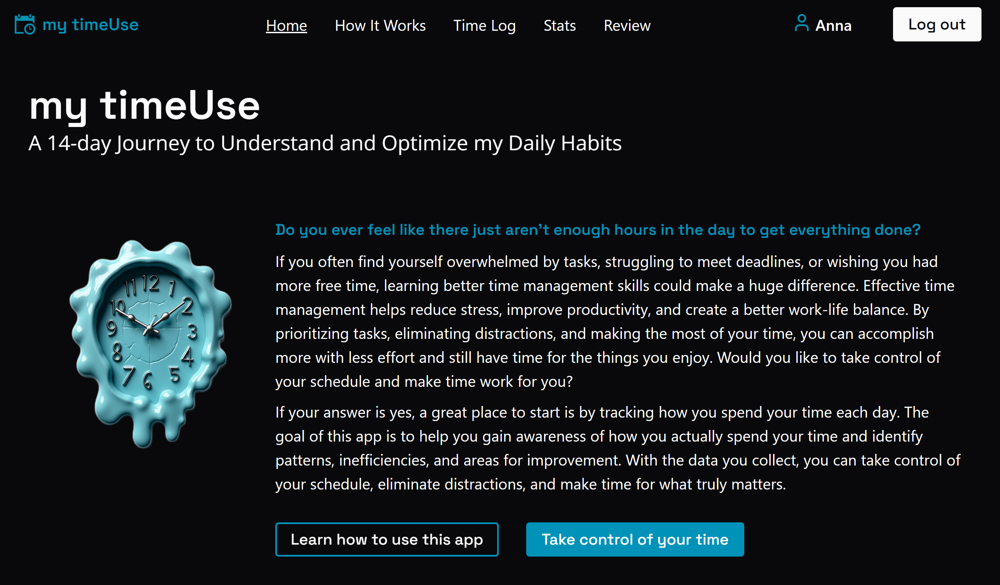
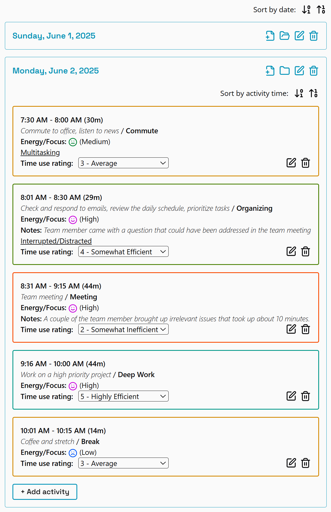
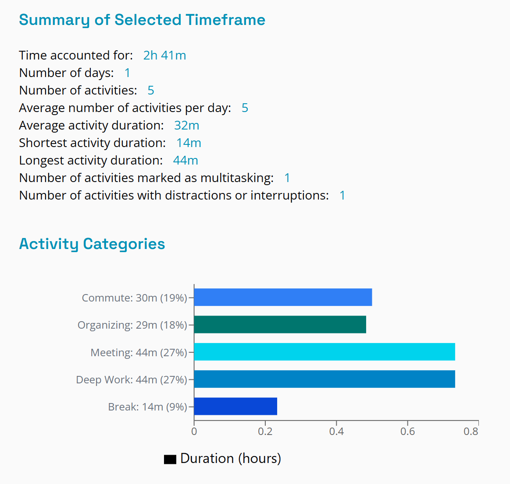
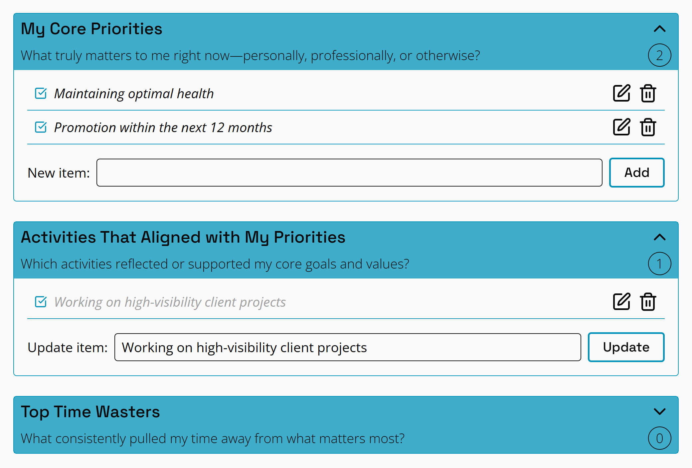

# my timeUse - Time Log Tracker

A full-featured time tracking app built with **React**, **Vite**, **Tailwind CSS**, **TypeScript**, and **Supabase**. You can track your daily activities, analyze your habits, and gain insights into how your time is spent. Built to demonstrate modern React development practices and optimized UI/UX as part of a front-end portfolio.

## Project Metadata

- **Project Name:** my timeUse
- **Description:** A personal time-tracking app built with React, TypeScript, Supabase, and Tailwind CSS. Track, categorize, and analyze your daily activities over a two-week period.
- **Author:** Anna Willis
- **Status:** Portfolio Ready
- **Live Demo:** [Live Demo on Netlify](https://ania-w-my-time-use.netlify.app)
- **Repository:** [GitHub Link](https://github.com/AniaWillis/my-time-use)
- **License:** MIT
- **Last Updated:** June 2025

## Features

- Log daily activities with start/end time, description, category, energy level, and optional notes
- Guided instructions to help users collect meaningful, accurate time data
- Evaluate efficiency using a 5-point scale
- Summarize and visualize time by category using **Recharts**
- Toast notifications with **react-toastify**
- Authenticated user experience via **Supabase Auth**
- Toggle dark/light mode with **theme persistence**

## Light and Dark Modes

Below are screenshots of the homepage intro in both light and dark themes.

| Light Mode                                 | Dark Mode                                |
| ------------------------------------------ | ---------------------------------------- |
|  |  |

## Authenticated Page Previews

These screenshots show pages available only to logged-in users.

| Sample Time Log                              | Summary Dashboard                          | Review / User's Insights                 |
| -------------------------------------------- | ------------------------------------------ | ---------------------------------------- |
|  |  |  |

## Tech Stack

| Category      | Stack                             |
| ------------- | --------------------------------- |
| Frontend      | React + TypeScript                |
| Styling       | Tailwind CSS, CSS Modules         |
| Routing       | React Router                      |
| Charts        | Recharts                          |
| Notifications | react-toastify                    |
| Auth & DB     | Supabase (Auth, Postgres DB)      |
| State Mgmt    | useState, useReducer, Context API |
| Build Tool    | Vite                              |

## React Patterns & Skills Demonstrated

### State Management

- `useState`, `useRef` for component/local state
- `useEffect`, `useCallback`, `useMemo` for lifecycle and performance
- `React.memo` for pure component optimization
- `useReducer` + **Context API** + **Custom Hooks** for global state:
  - `useAuth()` – handles Supabase authentication
  - `useRecords()` – manages time logs
  - `useTheme()` – toggles and persists UI theme

### Modular React Architecture

```bash
src/
├── assets/         # Images
├── auth/           # Auth-related views and logic
├── components/     # UI elements
├── constants/      # Static values like categories and colors
├── contexts/       # Context providers (auth, theme, records)
├── design/         # Theme-related design tokens
├── hooks/          # Custom hooks for app logic (contexts)
├── pages/          # Route-level pages
├── services/       # Database interaction
├── types/          # TypeScript types
├── utils/          # Date and time helpers, string formatters, etc.
```

## Supabase Backend

- Authentication with email/password (via Supabase Auth)
- Database schema includes tables for user time logs and user insights lists with RLS policies
- Real-time record updates and fetch via Supabase client
- Secure environment config via .env for Supabase credentials

## Styling Techniques

- Tailwind CSS for fast, consistent utility-first styling
- CSS Modules for scoped, component-specific styles
- Dynamic styling objects using clsx for variants (e.g. buttonStyles)
- Responsive layout across mobile and desktop

## UI & Finishing Touches

- Dark/Light mode switch with localStorage persistence
- Custom favicon for a professional browser experience
- Styled 404 fallback (if route not found)
- Toast alerts for feedback (errors, success, actions)

## Getting Started

### 1. Clone the Repository

```bash
git clone https://github.com/AniaWillis/my-time-use.git
cd my-time-use
```

### 2. Install Dependencies

Make sure you have Node.js installed, then run

```bash
npm install

```

### 3. Configure Environment Variables

Create `.env` file in the root directory and add your Supabase credentials:

```env
VITE_SUPABASE_URL=your-supabase-url
VITE_SUPABASE_ANON_KEY=your-anon-key
```

**Important:** Never commit your actual credentials to GitHub.

### 4. Run the Dev Server

```bash
npm run dev

```

## Deployment

This app is production-ready and easily deployable on:

- Netlify
- Vercel
- Supabase Hosting

## Testing and Browser Support

- Manual testing was performed across desktop and mobile screen sizes to ensure responsive layout and proper functionality.
- Confirmed to work in Chrome, Firefox, and Edge.
- _Note:_ Not tested in Safari or other browsers.

## About the Developer

This project is a part of my front-end developer portfolio. It was designed to showcase my ability to build structured, scalable, and user-friendly React applications.

## License

This project is licensed under the [MIT License](./LICENSE) © 2025 Anna Willis.
